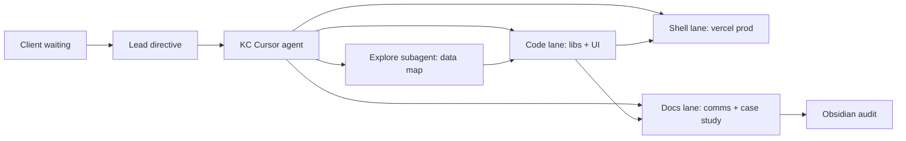

# 2026-05-14 — KC Fixtures Swarm Case Study (Audited)

## Executive summary

Five's Arena went live with regression recovery (`1356002`) while the client demo still showed **broken assets** and **empty fixtures**. This session treated that as a **service-in-society** incident: user-facing copy and data paths were corrected, league onboarding was added, and proof was written for Obsidian review.

## Symptoms (ground truth)

| Surface | User saw | Root cause |
|---------|--------|------------|
| Book a Court cards | Green pitch SVG / spinner | `courts.json` pointed at `.svg` placeholders; Mongo may mirror same filenames |
| `/fixtures` PL tab | “Schedule window not published yet” | iSports returned 0 rows but code did **not** fall back to FPL |
| Match Reactions | “Articles only” + API key hint | YouTube RapidAPI unset; UI leaked dev config |
| Fixtures footer | “Phase 1 check” | Leftover rollout copy |

## KC ↔ Swarm protocol

### Cassy apprenticeship rubric

| Role | Responsibility this session |
|------|------------------------------|
| **Teacher (Lead)** | Set priority: live client, elegant UX, 3-league mandate |
| **Student (KC agent)** | Implement minimal diffs, log proof, no scope creep on Atlas/Resend |
| **Auditor (Obsidian)** | This file + `comms-log.md` entries with Save/Kill/Watch |

## Changes shipped (file index)

| File | Purpose |
|------|---------|
| `lib/courtImage.js` | JPG preference over SVG placeholders |
| `data/courts.json` | Restore `court-*.jpg` filenames |
| `lib/sports/premierLeague.js` | FPL fallback when iSports empty |
| `lib/sports/leaguesCatalog.js` | 27-league catalog |
| `lib/sports/leaguePreferences.js` | localStorage for 3 favorites |
| `components/fixtures/LeagueOnboardingModal.jsx` | Mandatory pick-3 on `/fixtures` |
| `components/fixtures/FavoriteLeaguesRail.jsx` | Pinned leagues rail |
| `app/fixtures/page.jsx` | Onboarding + catalog switcher |
| `components/fixtures/PremierLeagueFixturesHub.jsx` | User copy; empty-state title |
| `components/home/HomeMediaHighlights.jsx` | Top-story hero when no video |
| `components/home/CourtsSection.jsx` | Image URL normalize + fallback |
| `app/page.jsx` | Fixtures sections immediately after hero |
| `lib/featureFlags.js` | Blackbox mask on in production |

## Verification checklist

- [ ] `https://fivesarena.com/images/courts/court-1.jpg` → 200
- [ ] `/fixtures?league=premier-league` shows match cards (FPL or iSports)
- [ ] First `/fixtures` visit → pick 3 leagues modal → rail visible
- [ ] Home: live fixtures strip above stats/tournament
- [ ] Match Reactions: top article hero (not “Articles only” dev box)
- [ ] Blackbox floater visible bottom-left on home (production)

## Out of scope (explicitly parked)

- Atlas durable offline sync proof
- Resend booking confirmations
- Full PL-parity tabs for all 27 leagues (FootballFixturesHub remains; catalog + onboarding unify discovery)

## Save / Kill / Watch

- **SAVE:** Court JPGs, FPL fallback, league onboarding, UX copy
- **WATCH:** `YOUTUBE_RAPIDAPI_KEY` for video reactions
- **WATCH:** iSports season ID alignment for non-PL leagues
- **KILL:** None

---

*Audited for Obsidian vault sync — `Bookit-5s-Arena/STRUCTURE/07-Sessions By Day/`*
