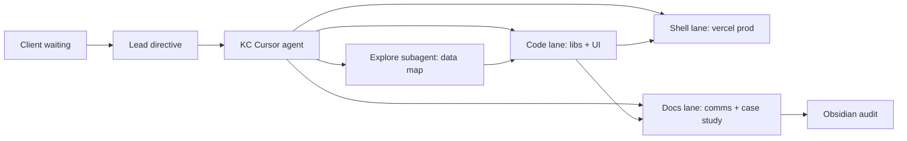

# 2026-05-14 — KC Fixtures Swarm Case Study (Audited)

## Executive summary

Five's Arena went live with regression recovery (`1356002`) while the client demo still showed **broken assets** and **empty fixtures**. This session treated that as a **service-in-society** incident: user-facing copy and data paths were corrected, league onboarding was added, and proof was written for Obsidian review.

## Symptoms (ground truth)

| Surface | User saw | Root cause |
|---------|--------|------------|
| Book a Court cards | Green pitch SVG / spinner | `courts.json` pointed at `.svg` placeholders; Mongo may mirror same filenames |
| `/fixtures` PL tab | “Schedule window not published yet” | iSports returned 0 rows but code did **not** fall back to FPL |
| Match Reactions | “Articles only” + API key hint | YouTube RapidAPI unset; UI leaked dev config |
| Fixtures footer | “Phase 1 check” | Leftover rollout copy |

## KC ↔ Swarm protocol



### Cassy apprenticeship rubric

| Role | Responsibility this session |
|------|------------------------------|
| **Teacher (Lead)** | Set priority: live client, elegant UX, 3-league mandate |
| **Student (KC agent)** | Implement minimal diffs, log proof, no scope creep on Atlas/Resend |
| **Auditor (Obsidian)** | This file + `comms-log.md` entries with Save/Kill/Watch |

## Changes shipped (file index)

| File | Purpose |
|------|---------|
| `lib/courtImage.js` | JPG preference over SVG placeholders |
| `data/courts.json` | Restore `court-*.jpg` filenames |
| `lib/sports/premierLeague.js` | FPL fallback when iSports empty |
| `lib/sports/leaguesCatalog.js` | 27-league catalog |
| `lib/sports/leaguePreferences.js` | localStorage for 3 favorites |
| `components/fixtures/LeagueOnboardingModal.jsx` | Mandatory pick-3 on `/fixtures` |
| `components/fixtures/FavoriteLeaguesRail.jsx` | Pinned leagues rail |
| `app/fixtures/page.jsx` | Onboarding + catalog switcher |
| `components/fixtures/PremierLeagueFixturesHub.jsx` | User copy; empty-state title |
| `components/home/HomeMediaHighlights.jsx` | Top-story hero when no video |
| `components/home/CourtsSection.jsx` | Image URL normalize + fallback |
| `app/page.jsx` | Fixtures sections immediately after hero |
| `lib/featureFlags.js` | Blackbox mask on in production |

## Verification checklist

- [ ] `https://fivesarena.com/images/courts/court-1.jpg` → 200
- [ ] `/fixtures?league=premier-league` shows match cards (FPL or iSports)
- [ ] First `/fixtures` visit → pick 3 leagues modal → rail visible
- [ ] Home: live fixtures strip above stats/tournament
- [ ] Match Reactions: top article hero (not “Articles only” dev box)
- [ ] Blackbox floater visible bottom-left on home (production)

## Out of scope (explicitly parked)

- Atlas durable offline sync proof
- Resend booking confirmations
- Full PL-parity tabs for all 27 leagues (FootballFixturesHub remains; catalog + onboarding unify discovery)

## Save / Kill / Watch

- **SAVE:** Court JPGs, FPL fallback, league onboarding, UX copy
- **WATCH:** `YOUTUBE_RAPIDAPI_KEY` for video reactions
- **WATCH:** iSports season ID alignment for non-PL leagues
- **KILL:** None

## Non-swarm handoff

Paste-ready recap for stakeholders who were not in the swarm (client, ops, Obsidian-only readers).

| Field | Value |
|-------|-------|
| **Site** | https://fivesarena.com |
| **Repo** | [Kopano-Labs/Bookit-5s-Arena](https://github.com/Kopano-Labs/Bookit-5s-Arena) |
| **Commits** | `daa4304` → `fc67f96` → `5ee86a3` → `bb3a994` → `16dab02` |
| **Date** | 2026-05-14 |

### What was wrong

- **Green court placeholders** — `courts.json` regressed to `.svg` pitch graphics instead of real `.jpg` photo assets, so the “Book a Court” rail showed generic green art instead of venue photos.
- **Empty PL fixtures (blank match window)** — iSports API returned 0 rows but the fetch layer treated that as success, so the fallback to FPL was never triggered and the PL tab rendered empty.
- **Dev-only YouTube copy leaking** — When `YOUTUBE_RAPIDAPI_KEY` was not set, the UI surfaced “articles only” / API key hint text meant for developers, not end users. *(Scrubbed in `bb3a994` — server config remains in `lib/media/config.js` only.)*
- **“Phase 1 check” / internal rollout text** — Fixtures page still contained internal rollout / provider-jargon copy from the initial Phase 1 launch.
- **Blackbox Market Mask misunderstanding** — Blackbox is a **strategy/market overlay floater** only; it does **not** restore or backfill assets. It is on in production via `lib/featureFlags.js` unless disabled in Vercel (see below).

### What is now shipped in production (`fc67f96`)

- **Court photos restored** — Real JPG paths are restored; `lib/courtImage.js` maps any SVG-style entries to the correct JPGs using Mongo data with a fallback mapping.
- **PL fixtures now reliable** — When iSports returns an empty result set, the fixtures loader falls back to the FPL schedule, so the PL tab and main match window no longer go blank.
- **Pick 3 leagues onboarding** — First visit to `/fixtures` triggers a mandatory “Pick 3 leagues” modal. Once selected, favorite leagues are pinned in a rail at the top, with the full catalog of 27 leagues beneath.
- **User-facing copy cleaned** — “Phase 1” and provider/internal jargon stripped from the fixtures flow; match centre and arena board wording is audience-facing only.
- **Home page ordering** — `HomeLiveFixtures` plus `FixturesPromo` sit directly beneath the hero to surface live football and fixtures earlier in the scroll.
- **Match Reactions behavior** — When clips cannot be loaded (no valid YouTube RapidAPI key or no clip), a “Match Reactions” top article hero is shown instead of dev-facing key hints on the happy path.

### Blackbox + feature flag status

| Item | Detail |
|------|--------|
| **Purpose** | Visual/strategy overlay on markets — not an asset-restore mechanism |
| **Live default** | Enabled on production via `lib/featureFlags.js` (`showBlackboxMarketMaskOnHome`) |
| **Kill switch** | Vercel → **Settings → Environment Variables** → set `NEXT_PUBLIC_BLACKBOX_MARKET_MASK=false` for Production (redeploy). Do not edit `featureFlags.js` for routine toggles. |

### Client demo checklist (production sanity path)

1. Hard-refresh **Home** → confirm real court photos under “Book a Court”.
2. Navigate to `/fixtures` → see mandatory “Pick 3 leagues” modal (use incognito if leagues already saved in `localStorage` key `5s_favorite_leagues_v1`).
3. Switch to **PL** tab → match cards visible (iSports empty → FPL fallback working).
4. Confirm **Blackbox** pulse in bottom-left of Home (floater visible on production).
5. Optional: set `YOUTUBE_RAPIDAPI_KEY` on Vercel (mark **Sensitive**, rotate post–April 2026 incident) to enable video reactions; without it, reactions fall back to articles-only hero.

### Hardening priority (post-demo)

1. **SVG/JPG asset mapping** — **Done** (`5ee86a3` CI guard + `npm run validate:court-assets`)
2. **Multi-provider fixtures fallback** — **Done for non-PL** (`16dab02` `lib/sports/fixturesProvider.js`: livescores → 7-day schedule window). **PL** still uses FPL fallback in `lib/sports/premierLeague.js`
3. **Feature-flag discipline** — Document overlay flags vs data flags; default off in preview
4. **YouTube UI scrub** — **Done** (`bb3a994`)
5. **AWS SM / Terraform** — Not scaffolded; Vercel P0 dashboard still manual

### Related Obsidian entries

- **Comms log:** `STRUCTURE/04-Updates/comms-log.md` (KC Swarm hotfix entry)
- **This case study:** `STRUCTURE/07-Sessions By Day/2026-05-14 - KC Fixtures Swarm Case Study.md`

## Security layer — blueprint (Vercel, AWS SM, Vault)

**Date:** 2026-05-14  
**Scope:** Post-`fc67f96` hotfix; April 2026 Vercel incident rotation guidance  
**Status:** **Locked decision** — P0 Vercel Sensitive + rotation; **P1 AWS Secrets Manager**; Vault deferred until multi-cloud / dynamic-secrets need  
**Implementation:** Not wired in repo yet (no `terraform/`, AWS SDK, or Vault SDK)

### Vercel env var audit (immediate)

Vercel encrypts env vars at rest, but **non-sensitive** values remain readable to anyone with project/team access. After the April 2026 incident, Vercel advised: rotate non-sensitive secrets, re-add with **Sensitive** enabled, treat previously exposed values as potentially compromised.

| Class | Rule | FivesArena examples |
|-------|------|---------------------|
| **Server-only secrets** | No `NEXT_PUBLIC_` prefix; mark **Sensitive** on Vercel; use only in API routes / server modules | `YOUTUBE_RAPIDAPI_KEY`, `ISPORTS_API_KEY`, `MONGODB_URI`, `NEXTAUTH_SECRET`, `PAYSTACK_SECRET_KEY`, `STRIPE_SECRET_KEY`, `RESEND_API_KEY`, `GROQ_API_KEY`, `ANTHROPIC_API_KEY`, `WHIN2_RAPIDAPI_KEY`, `GMAIL_APP_PASSWORD` |
| **Public config** | `NEXT_PUBLIC_*` only — inlined into client bundles | `NEXT_PUBLIC_BLACKBOX_MARKET_MASK`, `NEXT_PUBLIC_RECAPTCHA_SITE_KEY`, `NEXT_PUBLIC_GOOGLE_MAPS_API_KEY`, Giscus / OAuth client IDs |
| **Per-environment** | Production ≠ Preview ≠ Development | Use staging RapidAPI / test Mongo for Preview where possible |

**Immediate actions (dashboard, not code):**

1. Vercel → Settings → Environment Variables → audit every var.
2. For each secret: remove → re-add with **Sensitive** checked (Production + Preview as needed).
3. Rotate `YOUTUBE_RAPIDAPI_KEY` and any other keys in scope since April 2026.
4. Keep `lib/featureFlags.js` for logic only; toggle Blackbox via `NEXT_PUBLIC_BLACKBOX_MARKET_MASK` in Vercel.

**Code hygiene (follow-up PR):** scrub remaining env-var **names** in user-facing copy (`HomeMediaHighlights.jsx`, `PremierLeagueFixturesHub.jsx`, `ArenaFixturesExperience.jsx`).

### AWS Secrets Manager — why consider it

Managed store for API keys, DB URIs, and tokens with KMS encryption, IAM access control, versioning (`AWSCURRENT` / `AWSPENDING`), optional rotation, and CloudTrail audit. Complements Vercel: **secrets in AWS**, **public flags on Vercel**.

**Rough cost at FivesArena scale:** ~\$0.40/secret/month + \$0.05 per 10k API calls — on the order of **~\$8/month** for ~20 secrets and moderate fetch volume (verify on [AWS Secrets Manager pricing](https://aws.amazon.com/secrets-manager/pricing/)).

| Aspect | Vercel env (today) | AWS Secrets Manager |
|--------|-------------------|---------------------|
| Dashboard visibility | Non-sensitive vars readable | Values not returned after write (access via IAM only) |
| Rotation | Manual + redeploy | Scheduled / Lambda-backed for custom providers |
| Auditing | Vercel project logs | CloudTrail (+ optional GuardDuty) |
| Runtime | Static at build | Dynamic fetch with cache |

**Verdict:** Secrets Manager is stronger for **production secrets**. Vercel remains right for `NEXT_PUBLIC_*` and non-secret config.

### Integration patterns (Next.js + Vercel)

**P0 — Build-time injection (recommended first)**  
Terraform (Vercel provider) reads Secrets Manager at deploy and sets Vercel env vars. Zero runtime latency; no client bundle exposure.

```hcl
# infra/terraform/secrets.tf (reference — not in repo yet)
data "aws_secretsmanager_secret_version" "youtube_rapidapi" {
  secret_id = aws_secretsmanager_secret.youtube_rapidapi.id
}

resource "vercel_project_environment_variable" "youtube_rapidapi_key" {
  project_id = var.vercel_project_id
  key        = "YOUTUBE_RAPIDAPI_KEY"
  value      = jsondecode(data.aws_secretsmanager_secret_version.youtube_rapidapi.secret_string)["api_key"]
  sensitive  = true
  target     = ["production", "preview"]
}
```

**P1 — Runtime fetch (rotation-friendly)**  
Node.js API routes / server modules only (not Edge middleware). Cache in memory (e.g. 5-minute TTL).

```javascript
// lib/secrets/getSecret.js (reference — not in repo yet)
import { SecretsManagerClient, GetSecretValueCommand } from "@aws-sdk/client-secrets-manager";

const cache = new Map();
const TTL_MS = 5 * 60 * 1000;

export async function getSecretString(secretId) {
  const hit = cache.get(secretId);
  if (hit && Date.now() - hit.at < TTL_MS) return hit.value;

  const client = new SecretsManagerClient({ region: process.env.AWS_REGION || "eu-west-1" });
  const out = await client.send(new GetSecretValueCommand({ SecretId: secretId }));
  const value = out.SecretString ?? "";
  cache.set(secretId, { value, at: Date.now() });
  return value;
}
```

Wire credentials via **OIDC / IAM role** for Vercel → AWS (avoid long-lived access keys in env).

**Hybrid (target architecture):**

| Secret | Store | Fetch |
|--------|-------|-------|
| YouTube / iSports / Mongo / Paystack / Stripe / auth | Secrets Manager | Build-time inject **or** runtime + cache |
| `NEXT_PUBLIC_BLACKBOX_MARKET_MASK`, reCAPTCHA site key, maps key | Vercel env | Build-time only |

### Phased adoption roadmap (locked)

| Phase | When | Work | Provider |
|-------|------|------|----------|
| **P0** | This week | Vercel Sensitive flag + rotation; secret inventory in `.env.example`; scrub env-var names from UI | Vercel |
| **P1** | Next sprint | `infra/terraform/` SM → Vercel inject; CI deploy hook | AWS Secrets Manager |
| **P2** | Later | Runtime fetch + rotation for third-party keys; CloudTrail alerts | AWS |
| **P3** | Only if justified | HCP Vault Dedicated or self-hosted; dynamic secrets; multi-cloud | HashiCorp Vault |

### HashiCorp Vault — evaluation (May 2026)

Identity-based secrets platform: static + **dynamic** secrets (short-lived DB/IAM/API creds with auto-revocation), encryption-as-a-service (Transit, PKI), fine-grained policies, audit logging, replication. Deployment: Community (self-hosted), **HCP Vault Dedicated** (managed), or Enterprise.

**2026 platform note:** **HCP Vault Secrets** (lighter multi-tenant SaaS) reached **EOL July 1, 2026**. New work routes through HCP Vault Dedicated or self-hosted Community/Enterprise — not the retired Secrets SKU.

**FivesArena fit:** Powerful but **overkill** today — single Vercel/Next.js app, modest static secret count, no multi-cloud or per-request dynamic cred requirement.

**Rough cost (HCP Vault Dedicated, Essentials-class cluster):** ~\$1.1k+/month base + per-client fees vs AWS SM **~\$8–15/month** at our scale. Community is license-free but carries full ops burden.

| Tier / size | Hourly base (approx.) | Monthly cluster (approx.) | Per-client fee | Notes |
|-------------|----------------------|---------------------------|----------------|-------|
| **Essentials** | ~\$1.58/hr | ~\$1,152 + clients | \$72.92/mo | Basic HA |
| **Standard** | ~\$1.84/hr | ~\$1,345 + clients | \$72.92/mo | Full features |
| **Large** | ~\$7–9/hr | \$5k+ | \$72.92/mo | High scale |

**FivesArena estimate (10–20 secrets/clients):** **\$1,500–3,000+/month** minimum on HCP Dedicated vs **~\$8–15/month** on AWS SM. No generous Vault free tier post–HCP Vault Secrets EOL.

| Aspect | HashiCorp Vault (HCP Dedicated) | AWS Secrets Manager | FivesArena winner |
|--------|--------------------------------|---------------------|-------------------|
| **Dynamic secrets** | Native, on-demand, auto-expire | Mostly static + Lambda rotation | Vault (if we need it) |
| **Multi-cloud / hybrid** | Strong | AWS-only | Vault (future) |
| **Ease of use** | Policy-heavy, steeper curve | IAM + console | **AWS** |
| **Pricing** | High base + per-client | \$0.40/secret/mo + API calls | **AWS** |
| **Vercel integration** | HCP → Vercel sync; runtime SDK; Terraform | Terraform inject; runtime SDK | Tie |
| **Ops overhead** | Low on HCP / high self-hosted | Fully managed | **AWS** |
| **Audit / compliance** | Namespaces, Sentinel (Enterprise) | CloudTrail | Vault at enterprise scale |

**Vault integration options (reference only):**

1. **HCP Vault → Vercel sync** — push secrets into Vercel project env at deploy (similar to SM Terraform inject).
2. **Runtime fetch** — Vault SDK in API routes / server modules with in-memory cache (server-only; never client bundles).
3. **Terraform** — read Vault at build time via Vercel provider.
4. **Dynamic tokens** — community patterns for ephemeral third-party creds (e.g. per-session API access).

```javascript
// lib/secrets/vault.js (reference — not in repo yet; P3 only)
import vault from "node-vault";

const client = vault({
  endpoint: process.env.VAULT_ADDR,
  token: process.env.VAULT_TOKEN, // prefer AppRole / OIDC in production
});

export async function readVaultSecret(path) {
  const { data } = await client.read(path);
  return data?.data ?? {};
}
```

Local dev: `vercel env pull` + optional Vault dev server — do not commit tokens.

### Secret inventory (from codebase audit)

Server paths that read `process.env` today — candidates for Secrets Manager **values**, while keeping env **names** stable in app code:

- **Sports / media:** `ISPORTS_API_KEY`, `FOOTBALL_API_KEY`, `YOUTUBE_RAPIDAPI_KEY`, `YOUTUBE_RAPIDAPI_HOST`
- **Data:** `MONGODB_URI` (and aliases in `lib/mongodb.js`)
- **Auth / payments:** `NEXTAUTH_SECRET`, `PAYSTACK_SECRET_KEY`, `STRIPE_SECRET_KEY`, `STRIPE_WEBHOOK_SECRET`
- **Comms:** `RESEND_API_KEY`, `GMAIL_APP_PASSWORD`, `WHIN2_RAPIDAPI_*`, `WHATSAPP_API_KEY`
- **AI:** `GROQ_API_KEY`, `ANTHROPIC_API_KEY`

### Locked decision (team handoff)

| Choice | Decision |
|--------|----------|
| **Now (P0)** | Vercel: mark secrets **Sensitive**, rotate post–April 2026, per-environment scoping |
| **Next (P1–P2)** | **AWS Secrets Manager** — build-time Terraform inject to Vercel; runtime fetch only where rotation demands it |
| **Deferred (P3)** | **HashiCorp Vault** — revisit when multi-cloud, heavy dynamic secrets, or enterprise compliance justify ~\$1k+/mo and policy ops |
| **Always on Vercel** | `NEXT_PUBLIC_*` feature flags and public config only |

**Rationale:** MXIT efficiency — one codebase, zero leaks, **minimal ops overhead**. AWS delivers sufficient hygiene at ~1/100th Vault Dedicated cost for current scale. Vault remains the strategic upgrade path if the arena stack outgrows single-cloud Vercel + static API keys.

**Go / no-go:** Execute **P0 immediately** (no AWS/Vault dependency). Proceed **P1 AWS** when account + Vercel↔AWS OIDC are ready. **No Vault procurement** until P3 triggers are met.

---

*Audited for Obsidian vault sync — `Bookit-5s-Arena/STRUCTURE/07-Sessions By Day/`*
